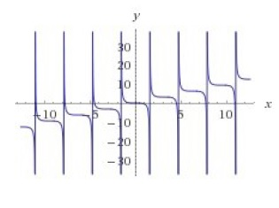
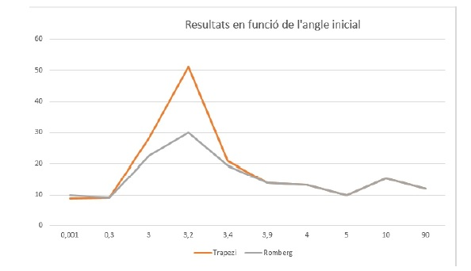
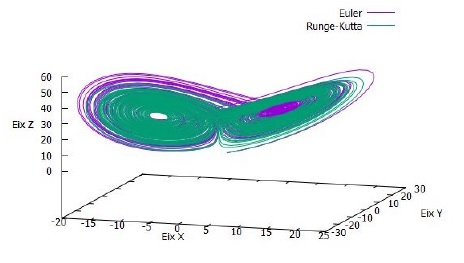

In this seminar, there have been 3 studies. First, P1MN-practice 1 of mètodes numèrics(numerical methods), has been proposed to consolidate knowledge in iterative processes and obtain
the roots of a non-linear equation using the Newton-Raphson method while using the C language. The function is $f(a)=a-tan(a)$, where a is an angle. The program will give you an output if the point you input is a root, saying it diverges. Also, you can plot the error using Gnuplot and the data given by the program.

\
*Roots of the function.*

In study 2 P2MN, different integration methods to calculate the period
of a non-harmonic motion pendulum are being used. In this case, the methods used will be the method of
trapezoids and the Romberg method. A comparison between the precision of these two
methods can also be established with the results obtained.
\
*Comparison chart using both methods*

In study 3 P3MN proposes to integrate the Lorentz-Haken equations using two different methods: the Euler and Runge-Kutta methods (of order 4). In this way, can actually be studied the behavior and the properties of the different solutions of these equations in the field of fluid dynamics and laser theory. The code will output a file that can be plot obtaining the next image:

\
*Superposition of both methods, showing their convergence*

